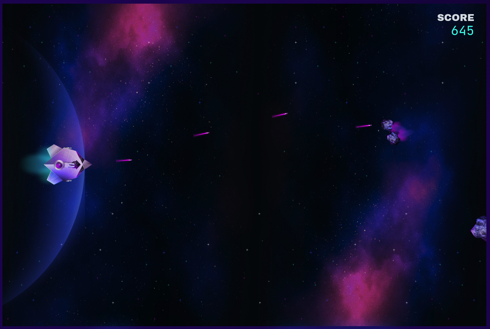

# Blitz 2024 Registration - /dev/null

TODOs:
- [ ] Refactor `game_search_state` out of `planner`
- [ ] Go through code remaining TODOs
- [ ] sections below

It is a little bit of a tradition now to put _just a smidge_ of overkill for the
[Coveo Blitz](https://2024.blitz.codes/) registration challenge:
- In 2023, we were solving the Traveling Salesperson Problem with
  [ant simulations](https://github.com/JesseEmond/blitz-2023-inscription);
- In 2022, we were
  [packing Tetrominoes](https://github.com/JesseEmond/blitz-2022-inscription)
  while [msanfacon@](https://twitter.com/msanfacon) was trolling us on the
  leaderboard;
- in 2021, we were hard-coding an HTTP server in C++ to parse ints
  [_lightning fast_](https://github.com/JesseEmond/blitz-2021-chal).

For this year, we're shooting rockets at asteroids, and the overkill took... a
different form.

## Summary

We are tasked with writing a bot for a stationary cannon that has to shoot
rockets at incoming meteors to score points. Larger meteors split into smaller &
faster meteors when hit. The difficulty in writing this bot lies in:
- Aiming rockets at moving meteors;
- Choosing what meteor to aim for before they go off screen, to maximize points;
- Unpredictability of meteor spawns and splits -- we don't know exactly where
  meteor splits will go until the parent meteor hit happens and we see the
  velocities of splits.

I started off with a Python bot that aims ahead at moving meteors, prioritizing
higher score ones, and _trying_ to simulate the server logic to verify intended
targets are hit.

Next, I wanted my bot to model future targets (the expected splits) to have
rockets already on the way as soon as the newer meteors appear. This can lead to
rocket misses, since the randomness can make our previous aim wrong, so this is
highly dependent on how exactly the server adds noise in split generation.
And this is where I went down a very deep rabbit hole...

... And it paid off. We ended up with a _very very accurate_ bot, and you'll see
exactly why in a bit.

The bot ended up with a **5000 points** game, in first position, at the end of
the event. For the video of the winning game, you can skip to the end of the
README.

## Challenge Description

The game we're playing looks something like this:



The game is tick-based, lasts 1000 ticks, and we have maximum **1s** to give our
actions for each game tick.

Our cannon, on the left, is positioned at
`(140, 400)`, and can shoot a rocket every 10 ticks. On each tick, we can send
an action to look at a point (or change orientation) and an action to shoot,
if our cannon has cooled down.

Meteors spawn at random heights on the very right, heading left with a random
orientation. Hitting a meteor can lead to it splitting into smaller meteors,
each with a random speed and an orientation relative to their parent meteor's
orientation.

The types of meteors are:
- **Large**: all spawns are of this type. They are worth 15 points, with a speed
  of 3 units/tick, and a radius of 40. On hit, it will split into two _Medium_
  meteors, each with a velocity at an angle relative to their parent's of -18°
  and +18°, respectively.
- **Medium**: Worth 40 points, with a speed of approximately 9 units/tick, and a
  radius of 20. On hit, will split into three _Small_ meteors, each with a
  velocity at an angle relative to their parent's of -30°, 0°, and +30°,
  respectively.
- **Small**: Worth 60 points, with a speed of approximately 13 units/tick, and a
  radius of 5.

Some interesting notes:
- _Small_ meteors are the hardest to hit (they're  small and fast) and are worth
  the most when hit (i.e. if we have to choose between two meteors about to exit
  the screen, we should prioritize the _Small_ one), but _Large_ have the
  highest score potential (i.e. if we have time, we should hit as many of the
  _Large_ descendents as we can);
- Split speeds have randomness in them, which means that we might miss a meteor
  if we guess it wrong when shooting early.

As for the specifics of how collisions are checked (checked every tick? or at
the sub-tick (continuous) level?) or how split positions are determined, we
aren't told -- we'll have to make guesses and check if they're right.

A game might look like this (for example, this is a 3655 points game):

[Game_3655pts.webm](https://github.com/JesseEmond/blitz-2024-registration/assets/1843555/324d7b47-27da-462b-9a22-0fe06c6327bd)

## Simple Bot

To start things off, I wrote some Python code to:
1. aim ahead of a meteor to hit it, picking & tracking existing targets;
2. simulate server tick logic to verify that our intended hits will happen;
3. infer what the server did between ticks to verify our predictions.

### Aim & Shoot

Shooting at a moving circle (meteor) with a known rocket speed (20) is a very
simplified version of ballistics (no acceleration, no gravity force, ...), which
thankfully is well documented for example in the context of
[game development](https://gamedev.stackexchange.com/q/25277). This link
provides the necessary formula, but it'd be interesting to derive it ourselves.

We can view the problem as having an expanding circle (at the speed of
`rocket_speed`) from our source position, which intersects with the meteor's
position at time `t`. We can visualize this as a triangle with an unknown angle
and solve for `t`, where we know the source position (cannon position), the
target's starting position (meteor's current position), and the collision
position being `meteor_pos + t * meteor_velocity`, for an unknown `t`. Visually:

TODO(emond): include diagram

From there we can derive the `a`, `b`, `c` to plug in our
[quadratic formula](https://en.wikipedia.org/wiki/Quadratic_formula):

<details>
  <summary>Math derivation</summary>

  ```
  TODO(emond): math derivation
  ```
</details>

This gives us a helper method to know where to aim to hit a meteor, using the
non-negative `t` solution (if any):
```py
@dataclasses.dataclass
class MovingCircle:
  pos: Vector
  vel: Vector
  size: float

def aim_ahead(source: Vector, rocket_speed: float,
              target: MovingCircle) -> Optional[Vector]:
  delta_pos = target.pos.minus(source)
  a = target.vel.dot(target.vel) - rocket_speed * rocket_speed
  b = 2 * target.vel.dot(delta_pos)
  c = delta_pos.dot(delta_pos)
  ts = solve_quadratic(a, b, c)
  if not ts:
    return None
  t = max(t)
  return target.pos.add(target.vel.scale(t))

def solve_quadratic(a: float, b: float,
                    c: float) -> Optional[Tuple[float, float]]:
  if a == 0:
    x = -c / b  // linear equation solving
    return x, x
  p = -b / (2 * a)
  det = b * b - 4 * a * c
  if det < 0:
    return None
  q = math.sqrt(det) / (2 * a)
  return p - q, p + q
```

But if we also try to predict the time of collision, we'd be wrong to use that
`t` directly, because that `t` tells us when the center of our rocket would
collide with the center of our meteor. The two circles (meteor with a size
depending on its type and rocket with a size of 5) will intersect before then.

To get the exact time of collision, we should instead use that aim point to get
our rocket's direction and velocity vector, and solve for the collision of the
two moving circles. We can view this as a problem of solving for the delta time
`t'` where both circles have a distance of `rocket_size + meteor_size`:

Solving for this takes a bit more work, so I'll refer to
[this answer](https://stackoverflow.com/a/50722146) for the specifics. We can
simplify some of the expressions with vector functions like `len_sq` and `dot`,
to then have a function like:
```py
def collision_times(x: MovingCircle,
                    y: MovingCircle) -> Optional[Tuple[float, float]]:
  r = x.size + y.size
  a = (x.vel.len_sq() + y.vel.len_sq()) - 2 * x.vel.dot(y.vel)
  b = 2 * (x.pos.dot(x.vel) + y.pos.dot(y.vel)
           - x.pos.dot(y.vel) - y.pos.dot(x.vel))
  c = x.pos.len_sq() + y.pos.len_sq() - 2 * x.pos.dot(y.pos) - r * r
  return solve_quadratic(a, b, c)
```

We won't have a use for this right away, but it will become useful later, in
part when we try to verify that our hits happen as predicted.

But with a aiming utility, I wrote a bot that aims for the first meteor worth
the highest points that it can hit in-bounds, remembering its already-shot-at
targets.

### Hit Simulation

We can aim at a single meteor and hit it, but as we start aiming at more meteors
our shots might start interacting with each other with their splits, so we also
want to, to some degree, simulate the logic the server is using to update
rockets & meteors and check for hits.

We want to do this in primarily 2 cases:
1. When picking a target, to make sure we'd actually hit it;
2. On every tick, to see if we should update our active targets to match
   reality (e.g. due to an unexpected spawn or split interaction).

But simulating the server logic involves _some_ amount of guess work: are
collisions checked at the sub-tick level? In what order are collisions checked?
If we try and model meteor splits, too, then we are faced with even more
questions: are meteor splits initially positioned on their parent's center or at
the point of collision? What is the range of randomness we can expect in angle &
speed?

### Deducing Tick Events

To help answer these questions and verify my assumptions, I wrote code that
infers what happened on the server between two ticks: spawns, hits, splits,
missed meteors, and missed rocket shots.

This can be tricky to do right, for example if we shoot a rocket and on the same
tick it hits a meteor (i.e. "insta-kill"), then we will never see that rocket in
the `GameMessage` tick info, yet meteors will disappear/split and IDs increase,
but a hit happened.

So I would run games with the local server, adding asserts on my expectations to
detect mismatches between my simulation and the real server logic, and iterate
when they were wrong, for example if the inferred scores mismatch.

For that purpose, I made a useful "event listener" framework to invoke listener
callbacks when an event happens. Here are example useful listeners that came out
of that:
- `Stats`: print events and track meaningful ones (missed meteors,
  wasted rockets, target reshuffles, etc.);
- `TargetTracker`: verify that intended hits happened and reassign targets every
  tick based on simulation;
- `Asserter`: utility class that tracks the tick info and, when an assertion
  fails, can print the full before/after state to help understand what went
  wrong.

### Simple Bot Results

Through some iteration, we eventually get a score of TODO pts:

TODO(emond): Game video, update score above

For the simple bot's code, see the branch
[`py_bot`](https://github.com/JesseEmond/blitz-2024-registration/tree/py_bot),
where the simple bot can be enabled via settings.

... But this is not 5000 points. And this README is nowhere near the end...
What's next?

## Rabbit Hole #1: What if Blitz was a CTF?

To improve my score and start predicting possible spawns/splits, I would have to
answer some questions about the server's logic, but that means playing guessing
games that I then verify with the local challenge binary.

But, what if we didn't have to guess? The game's logic is _right there_, in a
file called `./blitz-challenge-linux`. I like security challenges (Capture The
Flag challenges -- or CTF). Though it's not an area that I know a lot about, I
do have _some_ experience in Reverse Engineering (a lot of it through
[RingZer0](https://ringzer0ctf.com/profile/2574/dysleixa)), where we try to
understand what a binary is doing from the binary alone (e.g. by disassembling
it and looking at assembly code). What if I use the local binary to answer my
questions?

This is maybe not the most strategic use of my blitz time, but hey; it's a shiny
new thing I can look at to
[laterally procrastinate](https://www.structuredprocrastination.com/) instead of
improving my simple bot's heuristic!

### Disassembling the local binary

First, what _is_ that binary? It's interesting that it seems to be a compiled
binary and not, like, a Python-based app, a Jar, or some node app.

We can run `strings ./blitz-challenge-linux` to see some of the human-readable
strings embedded in the binary, and -- oh wow, a lot of symbols in the strings
suggest it is indeed NodeJS! ... As a packaged binary?

If we read online about this a bit, we find that there are a couple of solutions
to compile a node app to a native binary. One of these is
[vercel/pkg](https://github.com/vercel/pkg), and some `strings` outputs
definitely point to that.

#### Unpacking `vercel/pkg` binaries

Thankfully, someone already made a tool to "unpack" a `vercel/pkg` binary:
[pkg-unpacker](https://github.com/LockBlock-dev/pkg-unpacker). I was also glad
to see an example hardware reversing article making use of this tool and getting
back the original JS files,
[here](https://www.nozominetworks.com/blog/protecting-the-phoenix-unveiling-critical-vulnerabilities-in-phoenix-contact-hmi-part-2),
but they make a mention that `pkg` will only package the original JS files as-is
if the node package is public and does not have certain licenses.

Unfortunately for us, the unpacked `package.json` shows:
```
{
    "name": "@blitz/challenge",
    "private": true,
	...
}
```

So no dice for the nice JS files. All we get are files in some binary format we
don't know.

We're not the only ones that get stuck at that point, see this unanswered
upvoted stackexchange answer:
[stachexchange post](https://reverseengineering.stackexchange.com/questions/30921/decompiling-an-executable-compiled-by-vercel-pkg).

This seems to be somewhat deliberate; `vercel-pkg` highlights the following
benefits to the tool in the dev documentation (emphasis mine):
> [...] it doesn't store your source JavaScript directly. runs your JavaScript
> through the V8 compiler and produces a V8 snapshot, which has two nice
> consequences:
> 1. Your code will start faster, because all the work of parsing the
>    JavaScript source and so forth is already done
> 2. **Code is protected as it doesn’t live in the clear in the binary**

To be fair, on the main GitHub page there is this note (emphasis mine):
> While compiling to bytecode **does not make your source code 100% secure**, it
> does add a small layer of security/privacy/obscurity to your source code.

This is a good reminder of the limits of
["security through obscurity"](https://en.wikipedia.org/wiki/Security_through_obscurity).
If there's anything I've learned through CTFs, it's what patience and
perseverance can do to "not 100% secure". :)

At a high level, `vercel/pkg` works like this:
- Runs all the package JS files through `new vm.Script(...)`, to access and
  store their [`cachedData`](https://nodejs.org/api/vm.html#class-vmscript). As
  we'll see later, this (among other things) contains the "V8 bytecode" that
  NodeJS uses internally to represent parsed JavaScript (prior to generating
  actual machine assembly);
- Builds a NodeJS interpreter with patched changes, including having the cached
  data of all the scripts appended as data inside it;
- Instruments the NodeJS binary with a
  [bootstrap JS file](https://github.com/vercel/pkg/blob/main/prelude/bootstrap.js)
  that:
  - Knows how to read its own interpreter's binary file to extract the packaged
    payload data (cached scripts);
  - Replaces JS filesystem operations to go through a virtual filesystem
    abstraction that pretends that files starting with "/snapshot" are reading
    the original scripts, when in reality it is extracting them from its own
    payload data, see
    [this code](https://github.com/vercel/pkg/blob/bb042694e4289a1cbc530d2938babe35ccc84a93/prelude/bootstrap.js#L599).

This is an interesting approach overall, and now I appreciate a little bit more
that someone already did the work of unpackaging the files by parsing this
virtual filesystem with `pkg-unpacker`!

That being said, we're still left with the question: how do we reverse engineer
those unpacked cached data files?

#### Ghidra NodeJS plugin

##### Someone did the work for us!
That's when I found
[a great blog post](https://swarm.ptsecurity.com/how-we-bypassed-bytenode-and-decompiled-node-js-bytecode-in-ghidra/)
where the authors not only dive into the internals of V8 (JS engine used in
NodeJS) in great detail, but they also describe how they went about writing a
Ghidra add-on to reverse engineer such files!

If you are not familiar with [Ghidra](https://ghidra-sre.org/), it is an
open-source reverse engineering software developed by the NSA. Such software is
invaluable to analyze and explore binaries. One great feature is that it can
generate C-like equivalent to the disassembled binary, with the option to rename
variables & functions as you progressively understand the binary's logic more
and more. This feature is one of the reasons why the authors of the plugin
decided to leverage Ghidra instead of writing a standalone tool. Another big
advantage of Ghidra is that it is free, which is a lot more approachable than an
[Ida license](https://www.hex-rays.com/cgi-bin/quote.cgi/products) for a hobby!

So we just have to use that plugin and we're golden, ... right?

##### Okay, some assembly required
Alright, so the
[repository](https://github.com/PositiveTechnologies/ghidra_nodejs) for the
plugin is archived and read-only now and the only release version is for an
older version of Ghidra. I couldn't find a more recent one.

There are instructions to build it ourselves though, let's do that. We need to
install Eclipse, a bunch of dependencies, learn more about Ghidra plugins and
how they require running a Maven build to run a command that creates an Eclipse
project type for plugin development that we can later use to open the existing
GitHub plugin code and build plugins -- oh but now the Ghidra plugin API changed
in the newer version and we need to fix the repository to make it build with
Ghidra 10.4.

I'll be honest, I already (purposefully?) dropped from my memory the
step-by-step details it took to get it working, but I remember how annoying it
was. I was really grateful for finding
[this link](https://voidstarsec.com/blog/ghidra-dev-environment) at some point,
which really helped walk me through it.

But, it now builds! Now, we just have to load one of the unpacked V8 bytecode
files, say `game.js`... Annnnnd file type not auto detected by the add-on,
that's a bad sign. I tried to force pick the V8 x64 option, but we get no useful
disassembly, no dice.

##### Alright, we just need a crowbar
Maybe the plugin doesn't support our NodeJS' V8 version. It lists
[supported versions](https://github.com/PositiveTechnologies/ghidra_nodejs/blob/main/data/v8_versions.json),
what's ours?

`vercel/pkg` actually has a nice hidden feature for us where the packaged binary
it creates can be invoked to bypass the packaged application and open an
interpreter instead. This feature is alluded to
[in its bootstrap code](https://github.com/vercel/pkg/blob/bb042694e4289a1cbc530d2938babe35ccc84a93/prelude/bootstrap.js#L65), and we can run commands to figure out the versions in-use:
- `PKG_EXECPATH=PKG_INVOKE_NODEJS ./blitz-challenge-linux -v` tells us we are
  using NodeJS v18.5.0;
- `PKG_EXECPATH=PKG_INVOKE_NODEJS ./blitz-challenge-linux -p process.versions.v8`
  tells us we are using V8 `v10.2.154.4-node.8`.

The plugin only supports V8 versions
[up to 8.6.395.17](https://github.com/PositiveTechnologies/ghidra_nodejs/blob/7e2d5a9fad637f8e54809d40434879a5beb3fbba/data/v8_versions.json#L2),
can we just add ours?

I wanted to make sure I'm looking at the right version and that the plugin
_could_ be compatible with the `pkg` outputs we have (since the blog post was
more aimed at reversing `bytenode` file outputs), so I checked how the plugin
checks for version match. It is done based on a
[hash of the version components](https://github.com/PositiveTechnologies/ghidra_nodejs/blob/7e2d5a9fad637f8e54809d40434879a5beb3fbba/src/main/java/v8_bytecode/V8_VersionDetector.java#L32-L44),
compared with a stored value in the `cachedData` output.

I wrote a script to compute the hash:
[`v8_script_cache_version_hashes.py`](disassembled_js/v8_script_cache_version_hashes.py),
and running it on V8 version string `10.2.154.4` gave a 64-bit hash of
`af632352`, which indeed matched the stored version hash in our files:
```
xxd ./blitz-challenge-unpacked/snapshot/blitz-2024/challenge/dist/action.js | head

Outputs:
00000000: 6205 dec0 5223 63af af01 0000 2f12 c5a8  b...R#c...../...
[...]

I.e. the 2nd 32-bit integer is 522363af, which is 0xaf632352 stored in
little-endian! We'll see next what the 1st 32-bit integer represents.
```

So I added `"10.2.154.4"` to the list of versions and rebuilt the plugin.

The files would still not be auto detected as V8 x64. By looking at
[the plugin's logic](https://github.com/PositiveTechnologies/ghidra_nodejs/blob/7e2d5a9fad637f8e54809d40434879a5beb3fbba/src/main/java/v8_bytecode/V8_bytecodeLoader.java#L57)
to decide if a file is supported, I saw that it checks for a magic value as the
first 32-bits int: `0xC0DE0000` xor'ed with some constant `INSTANCE_SIZE`, set
to `0x03BE`. Our files have `0xC0DE0562` (see above, again in little-endian), so
I tried changing the `INSTANCE_SIZE` to `0x562`, rebuilt, and... Our file type
was auto-detected!

_But_, still no useful disassembly...

##### Maybe we're holding it wrong?
Maybe "crowbarring" our version in is not enough (who would have thought??).
Looks like we'll have to learn a little bit more about how the plugin works,
starting with parsing the input data.

To do so, it is very helpful to follow the logic internal to our V8 version to
parse `cachedData`,
[starting here after the header](https://github.com/nodejs/node/blob/0a18e136b4a1e860bb2befcbd1f78661ed5fb5e7/deps/v8/src/snapshot/object-deserializer.cc#L43).
Interestingly, the serialized format is a bytecode on its own -- a serialization
bytecode! I wrote a Python script to parse it at a very high level, just enough
to get the overall structure:
[`parse_v8_script_cache.py`](disassembled_js/parse_v8_script_cache.py).

Then, I compared the data I was parsing following
[V8 version `10.2.154.4`'s code](https://github.com/nodejs/node/tree/v18.5.0/deps/v8)
in NodeJS `v18.5.0` with how the Ghidra plugin
[was parsing it](https://github.com/PositiveTechnologies/ghidra_nodejs/blob/7e2d5a9fad637f8e54809d40434879a5beb3fbba/src/main/java/v8_bytecode/allocator/JscParser.java#L131),
starting with the headers.

##### Nope, nope, nope.

Right away, it looks like many things changed between V8 `8.6.395.17` and V8
`10.2.154.4`, including new serialization concepts/abstractions (e.g. objects
seem like they are no longer laid out in the same "space" order, serialization
bytecodes have changed, etc.) From reading the
[blog post](https://swarm.ptsecurity.com/how-we-bypassed-bytenode-and-decompiled-node-js-bytecode-in-ghidra/)
again, the serialization format is not trivial either, with pointers to earlier
serialized objects, repeats, many different encodings, etc.

It would be nice to work through the changes and make the plugin functional for
later versions. I was surprised by the general lack of up-to-date tooling to
reverse such applications (that I could find!) compared to other platforms, and
having an active non-archived repository with broad V8 versions support would be
quite nice. This might require active contributors, though, since the reality of
this bytecode being internal to V8 is that there really isn't much of a need for
a very stable API -- versions can change as needed.

Updating the plugin seemed non-trivial for a blitz timeframe, and this rabbit
hole is deep enough.

#### Reversing `vercel/pkg` outputs
But we're not giving up yet. We might not get the nice Ghidra C-like
decompilation for free, but we did learn a lot about V8 internals in the process
and might get disassembly out of it (i.e. view the V8 bytecode in human-readable
assembly, instead of a serialized binary file).

In fact, NodeJS supports disassembling V8 code generated from JS for us, e.g.
`node --print-bytecode -e 'function myfunc(x) { return x - 2 } myfunc(5)'`.
This will show you a bunch of assembly for functions we might not care about, so
let's use the filter flag:
`node --print-bytecode --print-bytecode-filter=myfunc -e 'function myfunc(x) { return x - 2  } myfunc(5)'`, we get:
```
[generated bytecode for function: myfunc (0x2b64c07e1729 <SharedFunctionInfo myfunc>)]
Bytecode length: 6
Parameter count 2
Register count 0
Frame size 0
OSR nesting level: 0
Bytecode Age: 0
   21 S> 0x2b64c07e1e7e @    0 : 0b 03             Ldar a0
   30 E> 0x2b64c07e1e80 @    2 : 45 02 00          SubSmi [2], [0]
   33 S> 0x2b64c07e1e83 @    5 : a8                Return
Constant pool (size = 0)
Handler Table (size = 0)
Source Position Table (size = 8)
0x2b64c07e1e89 <ByteArray[8]>
```

That's something!

If you're couple-weeks-ago-me, you might worry that you just wasted all this
time, because what if you just write a script that loads a `Script` from cached
data and outputs it, would that show you the disassembly right away, e.g. if you
had a JS file like:
```js
function my_loading_function() {
  const fs = require('fs');
  const { Script } = require('vm');
  const data = fs.readFileSync('./blitz-challenge-unpacked/snapshot/blitz-2024/challenge/dist/game.js');
  const options = { displayErrors: true, cachedData: data, sourceless: true };
  const script = new Script(undefined, options);
  script.runInThisContext();
}
my_loading_function()
```
Would running `--print-bytecode` while invoking it disassemble the cached data?

Couple-weeks-ago-me might be both disappointed and relieved (with all that time
spent on the Ghidra plugin) to find out that this doesn't work and only shows
the V8 bytecode that reads the cached data from disk and the `Script` calls, but
not the bytecode that gets loaded. However, maybe we can change NodeJS to
instead disassemble what we care about...

Here it's worth revisiting how `vercel/pkg` packages a NodeJS interpreter in its
output. It does so with the help of
[`vercel/pkg-fetch`](https://github.com/vercel/pkg-fetch), which will apply a
C++ version-specific patch to the NodeJS source code before building it. For our
version `v18.5.0`, it applies
[this patch](https://github.com/vercel/pkg-fetch/blob/6ffa969bc037f33cd5c926b8706324740c8818af/patches/node.v18.5.0.cpp.patch).
It makes some changes to the main args parsing (in part to force the first
argument to be the bootstrapping JS code it needs to setup the virtual
filesystem, and also to support `PKG_INVOKE_NODEJS`), as well as changes to
allow `Script` load-from-cache to allow loading cached data without a matching
JS source.

We can start from this, too!
```sh
# clone the NodeJS source code for our version
git clone https://github.com/nodejs/node.git
cd node
git checkout v18.5.0

# check that we can build NodeJS
./configure --ninja  # using 'Ninja' for faster builds
make -j4

# apply the patch from pkg
wget https://raw.githubusercontent.com/vercel/pkg-fetch/6ffa969bc037f33cd5c926b8706324740c8818af/patches/node.v18.5.0.cpp.patch
patch -p1 -i ./node.v18.5.0.cpp.patch

# build with our changes to check that our setup is functional
make -j4
PKG_EXECPATH=PKG_INVOKE_NODEJS ./node -v
```

Next, I applied changes to a convenient hook function that pkg adds to node,
after cached data is parsed: `FixSourcelessScript`. The following changes make
it so that any `Script` that loads from cached data will print out the
disassembly of the deserialized function, and recursively does the same for
called functions. I also added prints of per-function constants (e.g. to see
variable names) and object definitions. It will print memory addresses that will
change between runs, but we can work with that. Here is the hacky additionally
patched code (likely full of misguided uses of the V8 internal APIs):
```cpp
void V8::FixSourcelessScript(Isolate* v8_isolate, Local<UnboundScript> unbound_script) {
  auto isolate = reinterpret_cast<i::Isolate*>(v8_isolate);
  auto function_info =
      i::Handle<i::SharedFunctionInfo>::cast(Utils::OpenHandle(*unbound_script));
  CHECK(function_info->HasBytecodeArray());
  std::cout << "<< OUTPUTTING DISASSEMBLY BEGIN >>" << std::endl;
  std::vector<i::Address> disassembled_addrs;
  DisassembleBytecodes(isolate, function_info->GetBytecodeArray(isolate),
                       disassembled_addrs);
  std::cout << "<< OUTPUTTING DISASSEMBLY END >>" << std::endl;

  // ... original code from pkg-fetch
}

void DisassembleBytecodes(i::Isolate* isolate, i::BytecodeArray bytecode,
                          std::vector<i::Address>& seen_addrs) {
  seen_addrs.push_back(bytecode.GetFirstBytecodeAddress());
  std::cout << "=== ["
      << reinterpret_cast<const void*>(bytecode.GetFirstBytecodeAddress())
      << "] DISASSEMBLY ===" << std::endl;
  bytecode.Disassemble(std::cout);
  for (int i = 0; i < bytecode.constant_pool().length(); ++i) {
      const auto constant = bytecode.constant_pool().get(i);
      i::HeapObject heap_object;
      if (!constant.GetHeapObjectIfStrong(&heap_object)) {
          continue;
      }
      const auto cage_base = i::GetPtrComprCageBase(heap_object);
      if (heap_object.map(cage_base).instance_type() == i::FIXED_ARRAY_TYPE) {
          auto fixed_array = i::FixedArray::cast(heap_object);
          std::cout << "Array at " << i::AsHex::Address(constant.ptr())
              << " has " << fixed_array.length() << " elements:" << std::endl;
          fixed_array.Print(std::cout);
          std::cout << "Elements..." << std::endl;
          for (int i = 0; i < fixed_array.length(); ++i) {
              std::cout << "Element[" << i << "]" << std::endl;
              fixed_array.get(i).Print(std::cout);
          }
      } else if (heap_object.map(cage_base).instance_type() == i::OBJECT_BOILERPLATE_DESCRIPTION_TYPE) {
          std::cout << "Boilerplate at " << i::AsHex::Address(constant.ptr())
              << ": " << std::endl;
          PrintObjectBoilerplateDescription(heap_object);
      } else if (heap_object.map(cage_base).instance_type() == i::SHARED_FUNCTION_INFO_TYPE) {
          // Another SharedFunctionInfo to disassemble
          auto fn_info = i::SharedFunctionInfo::cast(heap_object);
          CHECK(fn_info.HasBytecodeArray());
          auto new_bytecode = fn_info.GetBytecodeArray(isolate);
          if (std::find(seen_addrs.begin(), seen_addrs.end(),
                        new_bytecode.GetFirstBytecodeAddress()) != seen_addrs.end()) {
              continue;
          }
          std::cout << i::AsHex::Address(constant.ptr()) << " points to: ["
              << reinterpret_cast<const void*>(new_bytecode.GetFirstBytecodeAddress())
              << "]" << std::endl;
          DisassembleBytecodes(isolate, new_bytecode, seen_addrs);
      }
  }
}

void PrintObjectBoilerplateDescription(const i::HeapObject& heap_object) {
  heap_object.Print(std::cout);
  std::cout << "[start ObjectBoilerplate nested objects]" << std::endl;
  auto fixed_array = i::FixedArray::cast(heap_object);
  for (int i = 0; i < fixed_array.length(); ++i) {
      i::HeapObject nested;
      if (!fixed_array.get(i).GetHeapObjectIfStrong(&nested)) {
          continue;
      }
      const auto cage_base = i::GetPtrComprCageBase(nested);
      if (nested.map(cage_base).instance_type() == i::OBJECT_BOILERPLATE_DESCRIPTION_TYPE) {
          PrintObjectBoilerplateDescription(nested);
      }
  }
  std::cout << "[end ObjectBoilerplate nested objects]" << std::endl;
}
```

We can then write a JS script that loads a `Script` from an unpacked `cachedData`:
```js
// disassemble_unpacked.js
const fs = require('fs');
const { Script } = require('vm');
const process = require('process');
const path = process.argv[2];
const cached_data = fs.readFileSync(path);
const options = { displayErrors: true, cachedData: cached_data, sourceless: true };
new Script(undefined, options);
```

And invoke it on an unpacked file:
```sh
./node ~/disassemble_unpacked.js ~/blitz-challenge-unpacked/snapshot/blitz-2024/challenge/dist/action.js
```

And... Finally! SUCCESS!

### Reverse Engineering V8 Assembly

Let's take a moment to define "success", here. For `action.js`, we get this:
```js
<< OUTPUTTING DISASSEMBLY BEGIN >>
=== [0x2ce3b5f64178] DISASSEMBLY ===
Parameter count 1
Register count 1
Frame size 8
OSR urgency: 0
Bytecode age: 0
    0 S> 0x2ce3b5f64178 @    0 : 80 00 00 00       CreateClosure [0], [0], #0
         0x2ce3b5f6417c @    4 : c4                Star0
  431 S> 0x2ce3b5f6417d @    5 : a9                Return
Constant pool (size = 1)
0x2ce3b5f64181: [FixedArray] in OldSpace
 - map: 0x10b7c85c12e1 <Map>
 - length: 1
           0: 0x2ce3b5f64199 <SharedFunctionInfo>
Handler Table (size = 0)
Source Position Table (size = 7)
0x2ce3b5f64611 <ByteArray[7]>
0x2ce3b5f64199 points to: [0x2ce3b5f64208]
=== [0x2ce3b5f64208] DISASSEMBLY ===
Parameter count 6
Register count 6
Frame size 48
OSR urgency: 0
Bytecode age: 0
   76 S> 0x2ce3b5f64208 @    0 : 21 00 00          LdaGlobal [0], [0]
         0x2ce3b5f6420b @    3 : c2                Star2
   83 E> 0x2ce3b5f6420c @    4 : 2d f8 01 02       GetNamedProperty r2, [1], [2]
         0x2ce3b5f64210 @    8 : c3                Star1
         0x2ce3b5f64211 @    9 : 13 02             LdaConstant [2]
         0x2ce3b5f64213 @   11 : c0                Star4
   98 E> 0x2ce3b5f64214 @   12 : 7c 03 04 29       CreateObjectLiteral [3], [4], #41
         0x2ce3b5f64218 @   16 : bf                Star5
         0x2ce3b5f64219 @   17 : 19 03 f7          Mov a0, r3
   83 E> 0x2ce3b5f6421c @   20 : 5c f9 f8 04 05    CallProperty r1, r2-r5, [5]
  139 S> 0x2ce3b5f64221 @   25 : 0e                LdaUndefined
  159 E> 0x2ce3b5f64222 @   26 : 32 03 04 07       SetNamedProperty a0, [4], [7]
  186 S> 0x2ce3b5f64226 @   30 : 80 05 00 02       CreateClosure [5], [0], #2
         0x2ce3b5f6422a @   34 : c3                Star1
  349 E> 0x2ce3b5f6422b @   35 : 2d 03 04 09       GetNamedProperty a0, [4], [9]
         0x2ce3b5f6422f @   39 : 96 0a             JumpIfToBooleanTrue [10] (0x2ce3b5f64239 @ 49)
  365 E> 0x2ce3b5f64231 @   41 : 7d                CreateEmptyObjectLiteral
         0x2ce3b5f64232 @   42 : c1                Star3
  385 E> 0x2ce3b5f64233 @   43 : 32 03 04 07       SetNamedProperty a0, [4], [7]
         0x2ce3b5f64237 @   47 : 0b f7             Ldar r3
         0x2ce3b5f64239 @   49 : c4                Star0
  326 E> 0x2ce3b5f6423a @   50 : 62 f9 fa 0b       CallUndefinedReceiver1 r1, r0, [11]
         0x2ce3b5f6423e @   54 : 0e                LdaUndefined
  428 S> 0x2ce3b5f6423f @   55 : a9                Return
Constant pool (size = 6)
0x2ce3b5f64241: [FixedArray] in OldSpace
 - map: 0x10b7c85c12e1 <Map>
 - length: 6
           0: 0x10b7c85c5ab9 <String[6]: #Object>
           1: 0x10b7c85c4c11 <String[14]: #defineProperty>
           2: 0x2ce3b5f64281 <String[10]: #__esModule>
           3: 0x2ce3b5f642a1 <ObjectBoilerplateDescription[3]>
           4: 0x2ce3b5f642c9 <String[11]: #ActionTypes>
           5: 0x2ce3b5f642e9 <SharedFunctionInfo>
Handler Table (size = 0)
Source Position Table (size = 31)
0x2ce3b5f64579 <ByteArray[31]>
Boilerplate at 0x2ce3b5f642a1:
0x2ce3b5f642a1: [ObjectBoilerplateDescription] in OldSpace
 - map: 0x10b7c85c2059 <Map>
 - length: 3
           0: 8
           1: 0x10b7c85c6419 <String[5]: #value>
           2: 0x10b7c85c1729 <true>
[start ObjectBoilerplate nested objects]
[end ObjectBoilerplate nested objects]
0x2ce3b5f642e9 points to: [0x2ce3b5f64358]
=== [0x2ce3b5f64358] DISASSEMBLY ===
Parameter count 2
Register count 0
Frame size 0
OSR urgency: 0
Bytecode age: 0
  216 S> 0x2ce3b5f64358 @    0 : 13 00             LdaConstant [0]
  238 E> 0x2ce3b5f6435a @    2 : 32 03 00 00       SetNamedProperty a0, [0], [0]
  254 S> 0x2ce3b5f6435e @    6 : 13 01             LdaConstant [1]
  276 E> 0x2ce3b5f64360 @    8 : 32 03 01 02       SetNamedProperty a0, [1], [2]
  292 S> 0x2ce3b5f64364 @   12 : 13 02             LdaConstant [2]
  313 E> 0x2ce3b5f64366 @   14 : 32 03 02 04       SetNamedProperty a0, [2], [4]
         0x2ce3b5f6436a @   18 : 0e                LdaUndefined
  324 S> 0x2ce3b5f6436b @   19 : a9                Return
Constant pool (size = 3)
0x2ce3b5f64371: [FixedArray] in OldSpace
 - map: 0x10b7c85c12e1 <Map>
 - length: 3
           0: 0x2ce3b5f64399 <String[6]: #ROTATE>
           1: 0x2ce3b5f643b1 <String[6]: #LOOKAT>
           2: 0x2ce3b5f643c9 <String[5]: #SHOOT>
Handler Table (size = 0)
Source Position Table (size = 17)
0x2ce3b5f643e1 <ByteArray[17]>
<< OUTPUTTING DISASSEMBLY END >>
```

Here are two very useful resources to understand the basics of V8 assembly:
[introductory blog post](https://medium.com/dailyjs/understanding-v8s-bytecode-317d46c94775)
and
[blog post with more examples](https://www.alibabacloud.com/blog/javascript-bytecode-v8-ignition-instructions_599188).
It is an "accumulator"-based language (i.e. most instructions implicitly
interact with an "accumulator" register).

For example, `true` would disassemble to:
```
    0 S> 0x35da680a171e @    0 : 11                LdaTrue
         0x35da680a171f @    1 : c3                Star0
    4 S> 0x35da680a1720 @    2 : a8                Return
```

This will:
1. Store the value `true` in the accumulator register;
2. Move the value of the accumulator to register `r0`;
3. Return, with the value of the accumulator still having `true`.

The following function:
```js
function my_function(x) {
    return x * 5 + 2;
}
my_function(1);
```

Would disassemble to (with some boilerplate removed):
```
   42 S> 0x3433613e17d9 @   11 : 21 01 00          LdaGlobal [1], [0]
         0x3433613e17dc @   14 : c2                Star1
         0x3433613e17dd @   15 : 0d 01             LdaSmi [1]
         0x3433613e17df @   17 : c1                Star2
   42 E> 0x3433613e17e0 @   18 : 61 f9 f8 02       CallUndefinedReceiver1 r1, r2, [2]
         0x3433613e17e4 @   22 : c3                Star0
   53 S> 0x3433613e17e5 @   23 : a8                Return
Constant pool (size = 2)
0x3433613e1779: [FixedArray] in OldSpace
 - map: 0x22a97f5812c1 <Map>
 - length: 2
           0: 0x3433613e1709 <FixedArray[2]>
           1: 0x3433613e1659 <String[7]: #my_func>

[generated bytecode for function: my_func (0x3433613e1729 <SharedFunctionInfo my_func>)]
   22 S> 0x3433613e1e7e @    0 : 0b 03             Ldar a0
   31 E> 0x3433613e1e80 @    2 : 46 05 01          MulSmi [5], [1]
   35 E> 0x3433613e1e83 @    5 : 44 02 00          AddSmi [2], [0]
   39 S> 0x3433613e1e86 @    8 : a8                Return
Constant pool (size = 0)
```

Let's break it down in pieces, with comments.

The function call:
```js
// Load into accumulator the value of <global>.<constant #1>
// In the constant pool above, we see that <constant #1> is the string "my_func"
// This is loading our 'my_func' function address from the global object.
// The [0] is a "FeedBackVector slot" index used for optimizations, we can
// ignore it.
LdaGlobal [1], [0]
// Store the value of acc (our my_func ptr) in 'r1'
Star1
// Load the constant '1' in acc
LdaSmi [1]
// Store the value of acc ('1') in 'r2'
Star2
// Make a function call expecting one argument, with ptr 'r1' (equal to my_func)
// and argument 'r2' (equal to 1).
// [2] is again a feedback slot, can ignore.
CallUndefinedReceiver1 r1, r2, [2]
// Store the return value of the function (in acc) in 'r0'
Star0
// Return, with 'acc' being the return value.
Return
```

The function definition:
```js
// Load the argument first argument, 'a0', in 'acc'
Ldar a0
// Multiply 'acc' by the constant '5'. (ignore the "[1]")
MulSmi [5], [1]
// Add to 'acc' the constant '2'. (ignore the "[0]")
AddSmi [2], [0]
// Return, with 'acc' being our return value.
Return
```

So you see how this is a bit tedious.

There does not seem to be an explicit documentation of all instructions. This
makes sense given that this is an internal format that can often change, but
this makes it tricky for us to work with. I found that the best source was to
look through
[this V8 file](https://github.com/nodejs/node/blob/v18.5.0/deps/v8/src/interpreter/interpreter-generator.cc)
for code comments/implementations of instructions.

Let's get back to our `action.js`, with some annotations and some parts cleaned
up for readability:
```js
// This is the module definition
=== [0x2ce3b5f64178] DISASSEMBLY ===
// Create a closure with the code at constant [0], which in reality is an
// address, but here I'll rename to some meaningful name 'enum_action'.
    0 S> 0x2ce3b5f64178 @    0 : 80 00 00 00       CreateClosure [0], [0], #0
// Store the closure in r0.
         0x2ce3b5f6417c @    4 : c4                Star0
// Exit
  431 S> 0x2ce3b5f6417d @    5 : a9                Return
Constant pool (size = 1)
0x2ce3b5f64181: [FixedArray] in OldSpace
 - map: 0x10b7c85c12e1 <Map>
 - length: 1
           0: 0x2ce3b5f64199 <SharedFunctionInfo>
0x2ce3b5f64199 points to: [enum_action]

=== [enum_action] DISASSEMBLY ===
// Loads constant [0] (string "Object") from global, i.e.:
// r2 = global.Object
   76 S> 0x2ce3b5f64208 @    0 : 21 00 00          LdaGlobal [0], [0]
         0x2ce3b5f6420b @    3 : c2                Star2

// Access property with name of constant [1] (string "defineProperty") on r2.
// r1 = r2.defineProperty (i.e. global.Object.defineProperty)

   83 E> 0x2ce3b5f6420c @    4 : 2d f8 01 02       GetNamedProperty r2, [1], [2]
         0x2ce3b5f64210 @    8 : c3                Star1
// r4 = constant #2 (i.e. acc = "__esModule")
         0x2ce3b5f64211 @    9 : 13 02             LdaConstant [2]
         0x2ce3b5f64213 @   11 : c0                Star4

// Create an object literal using the Object Definition in constant #3.
// That object definition essentially has the def for the object: {value: true}
// r5 = {value: true}
   98 E> 0x2ce3b5f64214 @   12 : 7c 03 04 29       CreateObjectLiteral [3], [4], #41
         0x2ce3b5f64218 @   16 : bf                Star5
// I believe 'a0' in the context of the NodeJS module creation is 'exports'.
// This would set r3 = exports
         0x2ce3b5f64219 @   17 : 19 03 f7          Mov a0, r3
// Call the property named 'r1' with arguments r2-r5, i.e. r2, r3, r4, r5.
// Here, r1 is defineProperty on r2 (Object), r3 is exports, r4 is "__esModule",
// and r5 is {value: true}.
// This is doing:
// Object.defineProperty(exports, "__esModule", {value: true})
   83 E> 0x2ce3b5f6421c @   20 : 5c f9 f8 04 05    CallProperty r1, r2-r5, [5]
// Set property with name of constant #4 ("ActionTypes") to undefined.
// exports.ActionTypes = undefined
  139 S> 0x2ce3b5f64221 @   25 : 0e                LdaUndefined
  159 E> 0x2ce3b5f64222 @   26 : 32 03 04 07       SetNamedProperty a0, [4], [7]
// Create function with code at [5] (call it define_actions)
// r1 = define_actions
  186 S> 0x2ce3b5f64226 @   30 : 80 05 00 02       CreateClosure [5], [0], #2
         0x2ce3b5f6422a @   34 : c3                Star1
// if Boolean(exports.define_actions): jump to offset 49 (tagged (*) below)
  349 E> 0x2ce3b5f6422b @   35 : 2d 03 04 09       GetNamedProperty a0, [4], [9]
         0x2ce3b5f6422f @   39 : 96 0a             JumpIfToBooleanTrue [10] (0x2ce3b5f64239 @ 49)
// if not...
// exports.ActionTypes = {}
  365 E> 0x2ce3b5f64231 @   41 : 7d                CreateEmptyObjectLiteral
         0x2ce3b5f64232 @   42 : c1                Star3
  385 E> 0x2ce3b5f64233 @   43 : 32 03 04 07       SetNamedProperty a0, [4], [7]
         0x2ce3b5f64237 @   47 : 0b f7             Ldar r3
// (*) jump point
// here acc is the value of exports.ActionTypes
// define_actions(exports.ActionTypes)
         0x2ce3b5f64239 @   49 : c4                Star0
  326 E> 0x2ce3b5f6423a @   50 : 62 f9 fa 0b       CallUndefinedReceiver1 r1, r0, [11]
// return undefined;
         0x2ce3b5f6423e @   54 : 0e                LdaUndefined
  428 S> 0x2ce3b5f6423f @   55 : a9                Return
Constant pool (size = 6)
0x2ce3b5f64241: [FixedArray] in OldSpace
 - map: 0x10b7c85c12e1 <Map>
 - length: 6
           0: 0x10b7c85c5ab9 <String[6]: #Object>
           1: 0x10b7c85c4c11 <String[14]: #defineProperty>
           2: 0x2ce3b5f64281 <String[10]: #__esModule>
           3: 0x2ce3b5f642a1 <ObjectBoilerplateDescription[3]>
           4: 0x2ce3b5f642c9 <String[11]: #ActionTypes>
           5: 0x2ce3b5f642e9 <SharedFunctionInfo>
Boilerplate at 0x2ce3b5f642a1:
0x2ce3b5f642a1: [ObjectBoilerplateDescription] in OldSpace
 - map: 0x10b7c85c2059 <Map>
 - length: 3
           0: 8
           1: 0x10b7c85c6419 <String[5]: #value>
           2: 0x10b7c85c1729 <true>
0x2ce3b5f642e9 points to: [define_actions]

=== [define_actions] DISASSEMBLY ===
// a0.ROTATE = "ROTATE"
  216 S> 0x2ce3b5f64358 @    0 : 13 00             LdaConstant [0]
  238 E> 0x2ce3b5f6435a @    2 : 32 03 00 00       SetNamedProperty a0, [0], [0]
// a0.LOOKAT = "LOOKAT"
  254 S> 0x2ce3b5f6435e @    6 : 13 01             LdaConstant [1]
  276 E> 0x2ce3b5f64360 @    8 : 32 03 01 02       SetNamedProperty a0, [1], [2]
// a0.SHOOT = "SHOOT"
  292 S> 0x2ce3b5f64364 @   12 : 13 02             LdaConstant [2]
  313 E> 0x2ce3b5f64366 @   14 : 32 03 02 04       SetNamedProperty a0, [2], [4]
// return undefined;
         0x2ce3b5f6436a @   18 : 0e                LdaUndefined
  324 S> 0x2ce3b5f6436b @   19 : a9                Return
Constant pool (size = 3)
0x2ce3b5f64371: [FixedArray] in OldSpace
 - map: 0x10b7c85c12e1 <Map>
 - length: 3
           0: 0x2ce3b5f64399 <String[6]: #ROTATE>
           1: 0x2ce3b5f643b1 <String[6]: #LOOKAT>
           2: 0x2ce3b5f643c9 <String[5]: #SHOOT>
```

This maps to something like:
```js
Object.defineProperty(exports, "__esModule", { value: true });
exports.ActionTypes = undefined;
if (!exports.ActionTypes) {
    exports.ActionTypes = {};
}
function define_actions(ActionTypes) {
    ActionTypes["ROTATE"] = "ROTATE";
    ActionTypes["LOOKAT"] = "LOOKAT";
    ActionTypes["SHOOT"] = "SHOOT";
}
define_actions(exports.ActionTypes);
```

I was initially worried I did something wrong, because what is this
`"__esModule"` all about? But then I found this
[stackoverflow question](https://stackoverflow.com/a/71668158) that made me
realize that this is something that Typescript includes in its transpiled JS of
modules. Sure enough, the following Typescript maps almost exactly to the same
JS:
[online typescript transpiler](https://www.typescriptlang.org/play?esModuleInterop=false&target=99&module=1&allowSyntheticDefaultImports=false#code/KYDwDg9gTgLgBMAdgVwLZwIIGMYEsKIAqAnmMAM5wDeAsAFACQASgPKEaECicAvHAESt2XfgBp6DADIsWAaQ68B0uRzESAygAkZhRfy061dAL5A)
```ts
export enum ActionTypes {
    ROTATE = "ROTATE",
    LOOKAT = "LOOKAT",
    SHOOT = "SHOOT",
}
```

We then get:
```js
Object.defineProperty(exports, "__esModule", { value: true });
exports.ActionTypes = void 0;
var ActionTypes;
(function (ActionTypes) {
    ActionTypes["ROTATE"] = "ROTATE";
    ActionTypes["LOOKAT"] = "LOOKAT";
    ActionTypes["SHOOT"] = "SHOOT";
})(ActionTypes || (exports.ActionTypes = ActionTypes = {}));
```

And, when I generate bytecode for this, I get a very similar output to our
disassembled file. Nice!

So, to recap, we'll be (hackily) disassembling V8 bytecode to infer JS, which
itself was JS that was generated from Coveo's original Typescript code.

Ouch! We're in for a ride!

### Answering Questions with Assembly
Now that we can disassemble unpacked files, we can start crawling back out of
our rabbit hole.

I wrote some tooling to reverse all the interesting packaged files:
[`disassemble.sh`](disassembled_js/disassemble.sh).
You can find the per-file result for the latest binary I disassembled in
[this directory](disassembled_js/c9b1ac089c04df60393d0f251f0df7d2/). I also made
a script to checksum the meaningful parts of the disassembly to make it easier
to find diffs between versions as challenge bugfixes get applied (this was
useful to spot a change that was made, which we'll see later):
[`checksum_disassembled_files.sh`](disassembled_js/checksum_disassembled_files.sh).

Let's sharpen our V8 disassembling skills by answering gradually more involved
questions about the challenge:
1. Are collisions detected within-tick or in discrete increments?
2. Where is the meteor splitting logic?
3. On meteor split, what is the source position?
4. On meteor split, how is the velocity computed (angle & speed noise)?
5. At what rate do we expect meteor spawns?
6. What are the parameters of meteor spawns (velocity & position noise)?
7. How are random numbers generated?

Don't worry, I'll spare you the disassembly from now on and just give my
inferred JS-like code. I'll also collapse the sections by default, if you don't
care about the details.

#### Q1: Are collisions detected within-tick or in discrete increments?

<details>

<summary> <b>Answer</b>: collisions are detected within-tick. </summary>

I started by looking at `game.js`.

I found the module to look something like the following at the time, with some
functions I didn't bother to reverse (and pretending there's no async involved):
```js
// game.js
engine = import("@blitz/engine");
error = import("./error");
world = import("./world");
vector = import("./vector");
random = import("./random");
meteor_infos = import("./meteor_infos");

exports.WORLD_WIDTH = 1200;
exports.WORLD_HEIGHT = 800;
exports.Blitz2024Challenge = class Blitz2024Challenge {
    DEFAULT_GAME_OPTIONS = {
        RANDOM_SEED: Math.random(),
        TICK_COUNT: 1000,
        SCORE_MULTIPLIER: 1,
        HEALTH_POINTS: Infinity,
        WORLD_DIMENSIONS = {width: exports.WORLD_WIDTH, height: exports.WORLD_HEIGHT},
        CANNON_INITIAL_ORIENTATION_DEG: 0,
        CANNON_POSITION: vector.Vector(140, exports.WORLD_HEIGHT / 2),
        CANNON_MAX_ROTATION: 180,
        CANNON_COOLDOWN_TICKS: 10,
        BULLET_SPEED: 20,
        BULLET_SIZE: 5,
        METEOR_GENERATION_CONE_ANGLE: 30,
        METEOR_GENERATION_DELAY_IN_TICKS: {start: 60, finish: 30},
        CHEAT_DISABLE_METEOR_GENERATION: false,
        CHEAT_GENERATE_PREDICTABLE_METEORS: [],
    }

    constructor(engine, options) {
        this.lastTickErrors = [];
        this.currentTickNumber = 1;
        this.engine = engine;
        this.options = { ...DEFAULT_GAME_OPTIONS, ...options };
        logger.info("Random seed: " + this.options.RANDOM_SEED);
    }

    setup() { /* ... */ }

    playOneTick(tick) {
        this.currentTickNumber = tick;
        if (this.isGameComplete()) {
            return {gameComplete: true, gameResults {results: this.getGameResults()}};
        }
        this.updateGame();
        if (!this.isGameComplete()) {
            this.fetchAndApplyPlayerCommands();
        }
        return {
            gameComplete: false,
            gameState: this.serializeForViewer(),
            errors: this.lastTickErrors,
            // commands: ...
        };
    }

    updateGame() {
        if (this.world) {
            this.world.update();
        }
    }

    // ...
};
```

A lot of things stand out, some of which we'll explore in follow-up questions:
- Meteor generation constants come from here;
- Updates happen before we send an action, i.e. the first tick info we receive
  on the client is after 1 update tick;
- The randomness in the game is seeded here, defaulting to `Math.random()` if
  not overloaded;
- There are some fun cheat options implemented;
- There's an idea of "health points" that is supported, that would have been
  tricky to balance as part of our bot!
- Most of the game update logic really lives in `world`.

If we reverse engineer `world.js`, we get something like this (some function
names I came up with, they're likely lambdas in reality):
```js
// ... world.js

function update(world) {
    if (this.tickCounter % this.getCurrentGenerationDelayInTicks() &&
        !this.options.CHEAT_DISABLE_METEOR_GENERATION) {
        let pos = Vector(this.width + 50, this.height * this.rng.random());
        let radius = this.rng.random() * 50 + 50;
        let angle = 180 - this.options.METEOR_GENERATION_CONE_ANGLE / 2
            + this.rng.random() * this.options.METEOR_GENERATION_CONE_ANGLE;
        let vel = Vector.fromPolarDeg(radius, angle);
        this.meteors.push(Meteor.Build(pos, vel, MeteorType.Large));
    }
    this.options.CHEAT_GENERATE_PREDICTABLE_METEORS
        .filter(this.isPredictedMeteorTick).forEach(this.buildPredictableMeteor);
    this.findAndHandleCollisions();
    this.meteors.forEach(this.meteorUpdate);
    this.meteors = this.meteors.filter(this.meteorInBoundsY);
    this.meteors.filter(this.hitPlanet).forEach(this.hurtHealth);
    this.meteors = this.meteors.filter(this.meteorInBoundsX)
        .filter(this.meteorIsNotDestroyed);
    this.rockets.forEach(this.rocketUpdate);
    this.rockets = this.rockets.filter(this.rocketInBoundsX)
        .filter(this.rocketIsNotDestroyed);
    this.tickCounter += 1;
    this.cannon.update();
}

function findAndHandleCollisions() {
    this.collisions = [];
    this.rockets.flatMap(this, this.allRocketCollisions)
        .sort(this.collisionSmallestTime)
        .forEach(this.handleCollision);
}

function allRocketCollisions(rocket) {
    return this.meteors.reduce(function(collisions, meteor) {
        let collision = Projectile.checkCollisionDuringCurrentTick(rocket, meteor);
        if (collision != null) {
            collision = collision.clone();
            collision.meteor = meteor;
            collision.rocket = rocket;
            return collisions.concat(collision)
        }
        return collisions;
    }, []);
}
```

Some new interesting notes:
- Rockets aren't checked for Y out-of-bounds! I tested this to be sure -- if I
  shoot a rocket directly up, for example, the server keeps sending me its
  position even when it gets very deep in the negatives;
- Collisions are checked before the update step;
- On a single tick, we find collisions between all rockets and all meteors,
  and then _handle them in the order of their collision time_.

This last one suggests that the server is checking for collisions with
continuous physics within-tick, but let's check `projectile.js` to be sure:
```js
// ... projectile.js

geoUtils = import("./geoUtils");

// ...

function checkCollisionDuringCurrentTick(p1, p2) {
    let intersection = geoUtils.movingCirclesIntersection(
        p1.position, p1.velocity, p1.size,
        p2.position, p2.velocity, p2.size);
    return intersection.filter(this.timeBetween0and1).sort(this.smallestTime).at(0) ?? null;
}
```

That settles it, then. Collisions are within-tick.

</details>

#### Q2: Where is the meteor splitting logic?

<details>

<summary> <b>Answer</b>: in <i>world.handleMeteorSplit</i>. </summary>

In `world.js` `findAndHandleCollisions()`, the call to the function
`handleCollision` seems like a promising place to check:
```js
// ... world.js

function handleCollision(collision) {
    if (collision.meteor.isDestroyed || collision.rocket.isDestroyed) {
        return;
    }
    this.collisions.push(collision);
    collision.meteor.destroy();
    collision.rocket.destroy();
    this.handleMeteorSplit();
    this._score += this.options.SCORE_MULTIPLIER * collision.meteor.score;
}
```

So `handleMeteorSplit`, then!
```js
// ... world.js

function handleMeteorSplit(collision) {
    collision.meteor.getMeteorsAfterExplosion(collision.intersection)
        .forEach(addMeteor);
}
```

</details>

#### Q3: On meteor split, what is the source position?

<details>

<summary> <b>Answer</b>: Split meteors spawn on the position of the collision intersection. </summary>

Let's see what `getMeteorsAfterExplosion` does, in `meteor.js`:
```js
// ... meteor.js

function getMeteorsAfterExplosion(intersection) {
    return this.meteorInfos.explodesInto.map(function(explode) {
        return Meteor.Build(
            intersection,
            this.velocity.rotate(explode.rotationRad).multiply(0.8),
            explode.meteorType)
    });
}
```

So it appears to be set to `intersection`. This comes from
`collision.intersection`. This intersection was created by calling
`geoUtils.movingCirclesIntersection`.

Let's reverse `geoUtils.js`:
```js
// ... geoUtils.js

function movingCirclesIntersection(a_pos, a_vel, a_size, b_pos, b_vel, b_size) {
    // ... here there's a bunch of math that essentially does exactly what our
    // earlier Python method 'collision_times' did! It sets a, b, c variables
    // to solve with the quadratic formula and get two time 'ts' (t1, t2):
    ts = [t1, t2];
    ts.map(function(t) {
        // Move the circles to the moment of collision
        let a_after = a_pos.add(a_vel.multiply(t));
        let b_after = b_pos.add(b_vel.multiply(t));
        // Move 'a_size' from a in the direction towards b -- this is the point
        // where the circles intersect.
        let intersection = b_after.subtract(a_after).normalized
            .multiply(a_size).add(a_after);
        return { t: t, intersection: intersection };
    });
}
```

So meteor splits will spawn on the position of the collision intersection.

Two interesting notes here:
- The server does `meteorUpdate` _after_ this, so our Bot will see the position
  of the collision intersection + one tick of velocity update;
- Even though the collision happens in the middle of a tick (e.g. `t=0.43`), the
  split meteor gets a full tick of velocity update (effectively got to move
  `1.43` ticks).

This last point is interesting, I'm not sure I would have guessed that if I was
still trying to simulate the game with guesswork. At least we didn't _fully_
waste our time with reverse engineering.

</details>

#### Q4: On meteor split, how is the velocity computed (angle & speed noise)?

<details>

<summary> <b>Answer</b>: the split angle is the parent's direction rotated by <i>explodesInto.approximateAngle</i> (no noise) with speed +- 20% of <i>info.approximateSpeed</i>. </summary>

We did see part of this earlier in `getMeteorsAfterExplosion`:
```js
// ... meteor.js

function getMeteorsAfterExplosion(intersection) {
    return this.meteorInfos.explodesInto.map(function(explode) {
        return Meteor.Build(
            intersection,
            this.velocity.rotate(explode.rotationRad).multiply(0.8),
            explode.meteorType)
    });
}
```

So it might suggest that:
1. The velocity angle is a direct offset of the parent, with no noise;
2. The velocity magnitude is 0.8 the parent's.

Turns out, 1) is true (so `approximateAngle` in the `explodesInto` constants we
get from the server is really not approximate!), but 2) is not -- the details
are in `Meteor.Build`:
```js
// ... meteor.js

function Build(pos, vel, typ) {
    let info = options.METEOR_TYPE_INFOS.get(typ);
    if (!info) {
        throw Error("Unknown meteor '" + typ + "'")
    }
    if (vel.magnitude > 0 && info.speed) {
        // The multiplier below is 0.8 to 1.2 (+- 20% the speed constant).
        let multiplier = Math.random() * 0.4 + 0.8;
        vel = vel.normalized.multiply(info.speed * multiplier);
    }
    return Meteor(pos, vel, typ, info)
}
```

So the `0.8` multiplication is really discarded (maybe the original intent was
to have collisions produce slightly slower meteors?), and the magnitude is
really +- 20% the `approximateSpeed` that the server gives us in constants.

</details>

#### Q5: At what rate do we expect meteor spawns?

<details>

<summary> <b>Answer</b>: linear change from ~1/60 ticks at the start to ~1/30 ticks at the end. </summary>

The code for this was in the first block of `world.update()`:
```js
// ... world.js

function update(world) {
    if (this.tickCounter % this.getCurrentGenerationDelayInTicks() &&
        !this.options.CHEAT_DISABLE_METEOR_GENERATION) {
        let pos = Vector(this.width + 50, this.height * this.rng.random());
        let radius = this.rng.random() * 50 + 50;
        let angle = 180 - this.options.METEOR_GENERATION_CONE_ANGLE / 2
            + this.rng.random() * this.options.METEOR_GENERATION_CONE_ANGLE;
        let vel = Vector.fromPolarDeg(radius, angle);
        this.meteors.push(Meteor.Build(pos, vel, MeteorType.Large));
    }
    // ...
}
```

So if the current tick is a multiple of the output of
`getCurrentGenerationDelayInTicks`, we spawn a meteor:
```js
// ... world.js

function getCurrentGenerationDelayInTicks() {
    let delays = this.options.METEOR_GENERATION_DELAY_IN_TICKS;
    let ratio = this.tickCounter / this.options.TICK_COUNT;
    let range = delays.start - delays.finish;
    return Math.round((1 - ratio) * range + delays.finish);
}
```

This is based on this setting in `game.js` options that we saw earlier:
`{start: 60, finish: 30}`.

In effect, this generates meteors at a rate of ~`1/60` ticks at the start, and
at a rate of `~1/30` ticks at the end, with a linear change of the rates as we
go. It might give unintuitive spawns because we check if the tick is a multiple
of `Math.round(/*current rate*/)`, but this is the function.

We also get a spawn on tick `0` because this function gets called when
`this.tickCounter` is still `0`. The first tick of "1" that we receive in the
bot is because `tickCounter` is incremented as the end of `world.update()`.

</details>

#### Q6: What are the parameters of meteor spawns (velocity & position noise)?

<details>

<summary> <b>Answer</b>: Spawns appear at <i>(width+50, height*random())</i> with a velocity angle randomly picked with <i>165 + random() * 30</i> and speed of <i>Large</i> +- 20%. </summary>

We already saw the answer for this in the `world.update()` disassembly:
```js
// ... world.js

function update(world) {
    if (this.tickCounter % this.getCurrentGenerationDelayInTicks() &&
        !this.options.CHEAT_DISABLE_METEOR_GENERATION) {
        let pos = Vector(this.width + 50, this.height * this.rng.random());
        let radius = this.rng.random() * 50 + 50;
        let angle = 180 - this.options.METEOR_GENERATION_CONE_ANGLE / 2
            + this.rng.random() * this.options.METEOR_GENERATION_CONE_ANGLE;
        let vel = Vector.fromPolarDeg(radius, angle);
        this.meteors.push(Meteor.Build(pos, vel, MeteorType.Large));
    }
    // ...
}
```

The starting position X is `width + 50`, and the height is randomly picked
between `0` and `height`.

The velocity is picked with
[Polar Coordinates](https://en.wikipedia.org/wiki/Polar_coordinate_system), i.e.
a speed and an angle:
- The speed is set to `random() * 50 + 50`, but as we saw
for meteor splits, this will be ignored and set based on `+- 20%` the `Large`
meteor speed, as part of `Meteor.Build`.
- The angle is picked randomly based on `METEOR_GENERATION_CONE_ANGLE`.

We saw `METEOR_GENERATION_CONE_ANGLE` defined in `game.js`, set to `30`.

Note here that, similar to splits, spawns happen before meteor updates. This
means that the first tick that the bot receives has this initial position +
velocity.

</details>

#### Q7: How are random numbers generated?

<details>

<summary> <b>Answer</b>: Uses <i>seedrandom</i> to generate repeatable games, but older version used <i>Math.random()</i> for meteor velocity randomness. The seed can be set via a command line argument, otherwise defaults to <i>Math.random().toString()</i> </summary>

For meteor spawns, the position Y randomness is based on `this.rng.random()`.
This `rng` is an instance that comes from the `random.js` file:
```ts
// ... random.js
import seedrandom = require('seedrandom');
exports.Random = class Random {
    rng: any

    constructor(seed: any) {
        this.rng = seedrandom(seed.toString());
    }

    random() {
        this.rng();
    }
};
```

This is using the [`seedrandom`](https://www.npmjs.com/package/seedrandom)
NodeJS package, which allows getting repeatable random number sequences by
providing a seed. This makes sense from the game's perspective -- it can be
useful to re-run games as-is.

The `seed` we saw is coming from the `RANDOM_SEED` option, coming in `game.js`.
By default, this gets initialized to `Math.random()`, and we see that it will be
used as a seed by running `.toString()` on it.

If a `RANDOM_SEED` is set through a command line argument, however, it will
instead use that (which I checked by reversing `challenge-launcher/index.js`).
The command line flag `randomSeed`, or its alias `mapName` both get used as a
seed.

For the randomness in splits & spawns velocity multiplier (+- 20%), however,
there is something interesting. The initial version of the challenge I
disassembled ([here](disassembled_js/328e68f033f493ba41575fe85f335210)), it was
using `Math.random()`, and not this `rng` seeded random number generator!

I imagine it was fixed at some point to allow repeatable games, because in a
later version I disassembled
([here](disassembled_js/c9b1ac089c04df60393d0f251f0df7d2)), the randomness was
switched to use the `rng` instance.

</details>

## Rabbit Hole #2: Nostradamus

So we answered all the answers we cared about to continue our Simple bot...

But then I had a thought. What if... we could predict the randomness? Again, I
like CTFs. I've predicted outputs from non-cryptographically secure random
numbers [before](https://github.com/JesseEmond/random-prediction) and
[again](https://github.com/JesseEmond/matasano-cryptopals/blob/3f9541dade85bf2d6325f831c9b9ea16805f450b/src/prng.py#L44)
in [Matasano cryptopals challenges](https://cryptopals.com/sets/3/challenges/23).

Imagine if we could repeat this here. If we can predict the next random numbers
that will be generated, we could fully predict the entire game -- future spawns,
future splits, and make a full action plan for the game without ever missing a
shot. And, because we went through all this work reverse engineering the server
logic, we know exactly in what order random numbers are generated, so we _can_
replicate the exact spawning/splitting logic, assuming we can produce the same
random numbers.

Wouldn't that be great?

### Math.random

I started off by looking at predicting the outputs of `Math.random()`, since
this is what I saw was being used to decide the velocities of split meteors at
the time.

The algorithm used by `Math.random` is implementation-defined by the
[JS standard](https://tc39.es/ecma262/multipage/numbers-and-dates.html#sec-math.random),
but it is notably not cryptographically secure (for cases where unpredictable
randomness is desired, the `Web Crypto API` would be the preferred API).

To know what algorithm is used, we'll have to look at how NodeJS implements it,
or more specifically how V8 implements it. `Math.random()`, implemented
[here](https://github.com/nodejs/node/blob/0a18e136b4a1e860bb2befcbd1f78661ed5fb5e7/deps/v8/src/builtins/math.tq#L443), ultimately calls a
`random_number_generator()->NexBytes(...)`
[here](https://github.com/nodejs/node/blob/0a18e136b4a1e860bb2befcbd1f78661ed5fb5e7/deps/v8/src/numbers/math-random.cc#L50),
which itself is implemented
[here](https://github.com/nodejs/node/blob/0a18e136b4a1e860bb2befcbd1f78661ed5fb5e7/deps/v8/src/base/utils/random-number-generator.h#L18).
So, it's using a
[`xorshift128+` algorithm](https://en.wikipedia.org/wiki/Xoroshiro128%2B) to
produce random numbers.
[This answer](https://security.stackexchange.com/a/110241) covers how other JS
implementations implement it, with other useful info.

Turns out, it is possible to predict future outputs of this random number
generator after seeing a few outputs. See
[this fun example](https://blog.securityevaluators.com/hacking-the-javascript-lottery-80cc437e3b7f),
predicting the lottery of a LA Times
[Powerball simulator](https://graphics.latimes.com/powerball-simulator/) to show
how unlikely you are to win. Well, if you can predict the random numbers... not
so unlikely. :) The author of the blogpost shows how to predict future outputs
of `Math.random()` by using the [`z3`](https://github.com/Z3Prover/z3)
[SMT](https://en.wikipedia.org/wiki/Satisfiability_modulo_theories) solver.

When doing this in V8, however, it is a little bit more nuanced. To reduce
the overhead of going from the `MathRandom` Torque implementation to the native
random number generation implementation, random numbers are generated in chunks
of [64](https://github.com/nodejs/node/blob/0a18e136b4a1e860bb2befcbd1f78661ed5fb5e7/deps/v8/src/numbers/math-random.h#L24)
numbers, then they are read back-to-front, until the cache needs to be
re-filled. Working around this is doable, though, and I would highly recommend
the talk
[Practical Exploitation of Math.random on V8](https://www.youtube.com/watch?v=_Iv6fBrcbAM&list=FL3xmQgwBqlHgVCsfksthvww&index=1)
that goes through the details.

So we can likely predict random numbers after seeing a few, but can we
bruteforce the seed after seeing just one, even? How is NodeJS seeding its
random number generator? We find that V8
[assumes](https://github.com/nodejs/node/blob/0a18e136b4a1e860bb2befcbd1f78661ed5fb5e7/deps/v8/src/base/utils/random-number-generator.h#L32-L35)
that it was provided a reasonable "entropy source" from its embedder (here,
NodeJS), otherwise it backs off to possibly weak entropy by default. And NodeJS
does, in fact, use strong entropy coming from OpenSSL
[here](https://github.com/nodejs/node/blob/0a18e136b4a1e860bb2befcbd1f78661ed5fb5e7/src/node.cc#L1144).
So we won't be able to bruteforce that effectively, then. Interestingly, though,
there was a fun bug in 2013 where NodeJS was setting the entropy pool too late
after V8 initialized, and V8 was then seeding very poorly using just time:
[bug](https://bugs.chromium.org/p/v8/issues/detail?id=2905), ouch!

Ultimately, the challenge binary eventually changed (as mentioned in the
randomness reversing section) to fully rely on `seedrandom`, removing our hopes
of predicting V8 `Math.random` outputs from meteor observations.

Our only hope to salvage `Math.random` prediction here would have been if
`seedrandom` is getting seeded through the default path
(`Math.random().toString()`). This is maybe a smaller entropy source than
intended for the seed, since it's generating a number between `0` and `1`, which
for JS floats (double-precision 64-bit numbers,
[IEEE 754](https://developer.mozilla.org/en-US/docs/Web/JavaScript/Reference/Global_Objects/Number#number_encoding)),
limits the amount of random bits a bit -- it amounts to 51 bits of randomness
(sign bit always positive, exponent always equivalent to `^(-1)`, mantissa 51
bits from `1.[...]`). Still, this is too much to bruteforce in our bot
timeframe.

### `seedrandom`

What about `seedrandom`? It is based on [RC4](https://en.wikipedia.org/wiki/RC4).
There are many known weaknesses with RC4 (infamously the wireless network
encryption [WEP](https://en.wikipedia.org/wiki/Wired_Equivalent_Privacy) can be
reliably broken to recover the key due to its (mis)use of RC4:
[details](https://en.wikipedia.org/wiki/Fluhrer,_Mantin_and_Shamir_attack)).
That being said, I'm not aware of a useful crypto attack here that would help us
either recover the seed or predict future outputs, for our games' timeframes.

If the seed that is given to `seedrandom` has enough entropy and is secret,
there's not much we can do, and our Nostradamus "predict everything" dream is
gone...

Hold on, I remember this piece of code:
```js
// ... game.js
exports.Blitz2024Challenge = class Blitz2024Challenge {
    // ...

    constructor(engine, options) {
        // ...
        logger.info("Random seed: " + this.options.RANDOM_SEED);
    }
}
```

... The seed is logged! Is there a useful pattern from game logs?

I looked at all my previous games and, sure enough, a set of only 5 seeds is
used (map names):
- `Stardreamer`
- `Nova_Explorer`
- `Celestial_Voyager`
- `Galactic_Guardian`
- `Solar_Serenity`

Well I certainly wish I had noticed that earlier. On the plus side, we did learn
a bunch about `Math.random` prediction...

Hey! That means we can fully predict games, doesn't it?

**HERE WE GO!**

## Rust Nostradamus Bot

Let's move to Rust, because I intend to do a search over possible actions, which
will benefit from better performance, and I don't want to implement the random
prediction twice.

I used [`pyo3`](https://github.com/PyO3/pyo3) to have Rust bindings in Python.
The Rust code that interfaces with Python is in [`lib.rs`](bot/src/lib.rs).

### Exactly Replicate Server Logic

I reimplemented the RC4 logic of `seedrandom` in
[`seedrandom.rs`](bot/src/seedrandom.rs), with some unit tests to make sure we can
generate the exact same floats.

I wrote a helper class `GameRandom` in
[`game_random.rs`](bot/src/game_random.rs):
- This primarily exposes two methods: `next_spawn` and `next_splits`. Both of
  those mimic what the server does, calling `rng.random` in the same order and
  the same amount of times, to be able to predict the same meteors as the server
  would; 
- It can be created with `infer_from_known_seeds`, where we give it the first
  tick `GameMessage` that the server sent us. From there, we take the first
  meteor, rewind it by one tick (since the server does spawn + update + send
  tick info), and try each of the 5 possible seeds to find which one would
  generate the same spawn.

I added a [`spawn_schedule.rs`](bot/src/spawn_schedule.rs) module that has the
same `is_spawn_tick` logic as the server does.

I wrote a simulation function that runs a single tick just like the server
would, in [`simulate.rs`](bot/src/simulate.rs).

I started by predicting all events that will happen and leveraging the
"event listener" framework in Python to check that the predicted events matched.
This helped me fix bugs and gain confidence that the Rust future-predicting
simulation matches the server's.

This allowed me to re-implement our simple Python bot, now in Rust, but where we
can now exactly verify hits. Additionally, we can start aiming at future
splits/spawns since we know exactly where they'll be (to aim at it, we can aim
at the future meteor "rewinded" by the amount of ticks left until it appears,
only treating it as a valid hit if the collision would happen post-spawn).

Going through all this also had a very nice benefit: I could write a Rust binary
[`main.rs`](bot/src/main.rs) that runs the Rust bot on all 5 possible seeds at
once and reports the score for each, which is much faster than dealing with
local servers and Python

This brought me to a score of TODO.

### Monte Carlo Tree Search

Instead of picking a target with heuristics, we can now run a full simulation to
compare various shooting options. I added a search for a sequence of moves, so
that we give the full game plan on the first tick, within a 1s time budget.

For the search, I used
[Monte Carlo Tree Search (MCTS)](https://en.wikipedia.org/wiki/Monte_Carlo_tree_search).
Normally, it'd be best to re-use a library (e.g.
[this one](https://docs.rs/mcts/latest/mcts/)), but I like using Blitz as an
opportunity to re-implement things and learn.

To work with a search algorithm, we want to define our game as having search
states (which can be seen as tree nodes) with possible actions on a state (which
can be seen as node edges) that lead us to a new state (children nodes):
- **State**: For our game, I create a
  [`game_search_state.rs`](bot/src/game_search_state.rs) struct with the
  `GameState` (active meteors & rockets and their positions, score, etc.) and
  the already-targeted meteors.
- **Actions**: Consider each meteor we could shoot at (current or future
  predicted meteors), skipping ones we already shot or ones that we can't/won't
  hit if we shot at them. Also include a "hold" action where we don't shoot yet.

MCTS works like this at a high level:
- _Select_: Start from our root state, select successive children nodes using
  some strategy until we reach a leaf node that has not been fully expanded yet;
- _Expand_: Choose one of the actions that has not been expanded yet on the
  node;
- _Simulation_: Playout the game until the end, either with random moves or with
  heuristics;
- _Backpropagation_: Update information of the nodes we explored along the way
  before simulation. This information will inform future node selections.

For heuristic purposes (e.g. to know which node to expand, or when doing
playouts), I simulated the tentative action while there are rockets left (I
named this "resolving" the state) to see what score a state will lead us to if
left as-is.

Doing a simulation with a heuristic is sometimes called "heavy playout", instead
of doing random simulation. I saw better results thorought from doing that,
presumably because the playouts are not super cheap and we don't have time to do
a lot of exploration of the actions space with just randomness.

I plugged this search into [`planner.rs`](bot/src/planner.rs), which just runs
a search on the first tick (within 1s) and returns the best seen path. The
Python bot will then just follow this plan for the rest of the game.

I was able to get a score of TODO points with this strategy.

### MCTS tweaks

I then spent a bit improving the MCTS search, to try and find better sequences
of actions.

One quick change to improve exploration was to add a change during playout to
sometimes pick a random action, based on a probability (in practice: 5%). This
is like
[`-greedy`](https://en.wikipedia.org/wiki/Reinforcement_learning#Exploration) in
Reinforcement Learning. Doing this instead of tweaking the exploration constant
[`c` in MCTS' UCT](https://en.wikipedia.org/wiki/Monte_Carlo_tree_search#Exploration_and_exploitation)
consistently gave better results.

This started giving me scores in the >4900 range!

I really wanted to break the 5000 points barrier, so I kept trying other ideas
to make sure the search state can capture better solutions, and that our search
can find them:
- In the search state, allow actions to mess with previously planned hits (e.g.
  if we hit a meteor before some future prediction we made, this will change the
  RNG order and make our previous predictions incorrect). Instead, just update
  the list of predicted hits when this happens;
- Run MCTS for a 800ms _every tick_, instead of planning the entire game on tick
  #1. This leads to pretty long games (~15 mins), but gives us more time to
  search the late game state space.
- Instead of picking the next move based on the MCTS node that has the most
  visits, I always keep track of the "best seen path" and follow it.
- Consider more aiming options instead of just the position where the rocket
  and meteor centers would collide. Aiming the edges of the meteor can lead to
  hits previously impossible (e.g. on the edge of the cannon), or hits that keep
  the splits in-game for longer;
- [SP-MCTS](https://dke.maastrichtuniversity.nl/m.winands/documents/CGSameGame.pdf)
  tweak to the UCT formulation, changes geared for single-player game usages of
  MCTS;
- When we find a good playout path (e.g. >= our best seen score), backpropagate
  through the entire playout paths (including nodes that haven't been expanded
  yet).

With all this, I was able to locally get scores in the 4955 range. Time to score
on the server!

### Out of Memory

And... I got a score of -1.

My bot would suddenly stop in the middle of the game it looked like. I added
logs, and all ticks would take ~800ms, when suddenly a tick would take many
_seconds_!

I got a beefy desktop not too long ago, so I suspected that it might be due to
excessive memory usage that would be fine locally but not on server. I added
[a lib](https://docs.rs/memory-stats/latest/memory_stats/) to print memory stats
per tick, and sure enough the breakage would happen close to the ~1GB mark.
Maybe the virtualization that runs our bot on server has ~1GB configured, at
which point it will start paging out memory or similar.

To work around this, I added logic so that when the tree goes past a limit of
number of nodes, we reset the MCTS tree completely (but keep the best path
still). This is also somewhat inspired by the "meta search" mentioned in the 
[SP-MCTS paper](https://dke.maastrichtuniversity.nl/m.winands/documents/CGSameGame.pdf),
where they find that running multiple MCTS from scratch gave better results then
one long-running MCTS (with the same compute budget).

From offline, this change surprisingly... Gave better scores? I saw that 4980
was now possible!

So I ran it on the server and... **5000 points**!

## Winning Game
Here is the final game:

[Game_5000pts.webm](https://github.com/JesseEmond/blitz-2024-registration/assets/1843555/cb64d3a2-257e-4397-8926-da7d6870a836)

It's cool to see the bot dodge hitting the large meteors towards the end,
focusing instead on the higher-points smaller meteors it has time to hit before
the game ends.

One tricky part when looking at such games is also that it's hard to tell when a
move that looks weird/suboptimal is due to a lack of searching, or because it
indirectly leads to a more favorable random number sequence.

### Post-Blitz Follow-ups
I tried a few additional things after the end of the event, out of curiosity to
see if they could have brought the score higher.

I implemented an optimized version of "resolving" a simulation, where we can
skip ahead to the next tick where something will happen (a hit or a spawn),
instead of updating one tick at a time. This gave a throughput more than twice
as fast of simulations/second! I also added multithreading to run multiple MCTS
searches in parallel.

In all cases, I did not see a score higher than 5000 points online! Phew!
